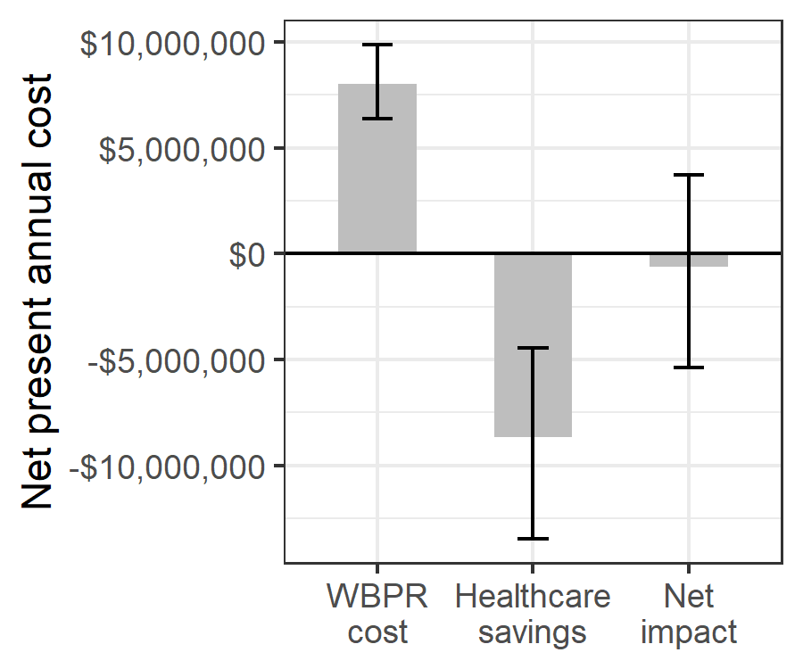

::: {custom-style="Compact"}
**Running title:** Pathogen reduction in Ghana

<br>

W. Alton Russell^1,2,3^, Shirley Owusu-Ofori^4^, Alex Owusu-Ofori^5,6^, Eileen Micah^7^, Betty Norman^7^, Brian Custer^2,8^

<br>

^1^Department of Management Science and Engineering, Stanford University, Stanford, USA

^2^Vitalant Research Institute, San Francisco, USA

^3^MGH Institute for Technology Assessment, Harvard Medical School, Boston, USA

^4^Transfusion Medicine Unit, Komfo-Anokye Teaching Hospital, Kumasi, Ghana

^5^Laboratory Services Directorate, Komfo-Anokye Teaching Hospital, Kumasi, Ghana

^6^Department of Clinical Microbiology, Nkrumah University of Science and Technology, Kumasi, Ghana

^7^Department of Medicine, Komfo-Anokye Teaching Hospital, Kumasi, Ghana

^8^Department of Laboratory Medicine, University of California, San Francisco, CA

<br>

**Corresponding author:** W. Alton Russell, Harvard Medical School, 101 Merrimac St, Room 1032, Boston, MA, 02114, United States. email: [warussell\@mgh.harvard.edu](mailto:warussell@mgh.harvard.edu){.email}.

<br>

**Funding:** This work was supported by Terumo BCT, Inc. (Lakewood, Colorado, USA). Terumo BCT provided no editorial control over the research or the manuscript.

<br>

**Precis:** We estimate that whole blood pathogen inactivation would avert many transfusion related adverse events in Ghana and may be cost-saving.

<br>

**Acknowledgments:** The authors thank Dr. Marcia Cardoso of Terumo BCT for providing technical expertise and contributing to the development of the analysis and manuscript. We also thank Ms. Marion Vermeulen of the South African National Blood Supply for providing unpublished hemovigilance data for syphilis; Dr. Lucy Asamoah-Akuoko of the National Blood Service, Ghana, for providing unpublished data on the percent of whole blood units not transfused; and Nigel Talboys and Eric Mwenda of Terumo BCT, Inc. for providing estimated costs for whole blood pathogen reduction.

<br>

**Key words:** Pathogen reduction, blood safety, cost-utility, sub-Saharan Africa

<br>

3352 words \| 27 pages \| 2 tables \| 4 figures

<br>

**Abbreviations:** **AVT** antiviral therapy, **FNHTR** febrile non-hemolytic transfusion reaction, **HBV** hepatitis B, **HCV** hepatitis C, **HIV** human immunodeficiency virus, **WBPR** whole blood pathogen reduction.
:::

##### 

```{r setup, include=FALSE}
library(ggplot2)
library(ggExtra)
#library(gridExtra)
library(flextable)
library(ftExtra)
library(officedown)
library(officer)
#library(knitr)
theme_set(theme_bw())
library(readxl)
library(data.table)
library(scales)
```

```{r read_format_data, include=FALSE}

#read in parameter tables
#all_cause_mort <- data.table(read_excel("../data/Ghana_hea_parameters.xlsx", sheet = "All_cause_mort"))
dt_transitions <- data.table(read_excel("../data/Ghana_hea_parameters.xlsx", sheet = "Markov_probs"))
dt_microcost_params <- data.table(read_excel("../data/Ghana_hea_parameters.xlsx", sheet = "Microcost_params"))
dt_riskmod_params <- data.table(read_excel("../data/Ghana_hea_parameters.xlsx", sheet = "riskmod_params"))
dt_daly_params <- data.table(read_excel("../data/Ghana_hea_parameters.xlsx", sheet = "daly_params"))

#read in results
dt_bc_outcomes <- fread("../results/BC_outcomes.csv")
dt_bc_costs <- fread("../results/BC_costs.csv")
dt_bc_dalys <- fread("../results/BC_dalys.csv")
dt_PSA_microcost <- fread("../results/PSA_microcost.csv")
dt_PSA_params <- fread("../results/PSA_params.csv")
dt_psa_costs <- fread("../results/PSA_costs.csv")
dt_psa_dalys <- fread("../results/PSA_dalys.csv")
dt_psa_outcomes <- fread("../results/PSA_outcomes.csv")
dt_univ <- fread("../results/univ_sens_analysis.csv")


#Gen results table
ae_abbrevs <- c("sep", "mal", "ftr", "syp", "hbv", "hcv", "hiv")

dt_bc_outcomes_count <- dt_bc_outcomes[ , lapply(.SD, comma)]
dt_bc_outcomes_dollar <- dt_bc_outcomes[ , lapply(.SD, dollar)]
dt_bc_outcomes_number <- dt_bc_outcomes[ , lapply(.SD, comma, accuracy = .01)]

dt_range_count <- dt_psa_outcomes[ , lapply(.SD,
                          function(x)
                          paste0("(",
                          comma(min(quantile(x, probs = c(0.025, 0.975)))),
                          " – ",
                          comma(max(quantile(x, probs = c(0.025, 0.975)))),
                          ")")
                            )]

dt_range_number <- dt_psa_outcomes[ , lapply(.SD,
                          function(x)
                          paste0("(",
                          comma(min(quantile(x, probs = c(0.025, 0.975))),
                                accuracy = .01),
                          " – ",
                          comma(max(quantile(x, probs = c(0.025, 0.975))),
                                accuracy = .01),
                          ")")
                            )]

dt_range_dollar <- dt_psa_outcomes[ , lapply(.SD,
                          function(x)
                          paste0("(",
                          dollar(min(quantile(x, probs = c(0.025, 0.975)))),
                          " – ",
                          dollar(max(quantile(x, probs = c(0.025, 0.975)))),
                          ")")
                            )]
dt_range_np_costs <- dt_psa_costs[, lapply(.SD,
                              function(x)
                          paste0("(",
                          dollar(min(quantile(x, probs = c(0.025, 0.975)))),
                          " – ",
                          dollar(max(quantile(x, probs = c(0.025, 0.975)))),
                          ")")),
                          .SDcols = ae_abbrevs]

dt_range_np_dalys <- dt_psa_dalys[, lapply(.SD,
                              function(x)
                          paste0("(",
                          signif(min(quantile(x, probs = c(0.025, 0.975))),2),
                          " – ",
                          signif(max(quantile(x, probs = c(0.025, 0.975))),2),
                          ")"))]


outcomes_count <- c("cases_no_prt", "cases_prt", "cases_reduced")
outcomes_dollar <- c("burden_no_prt", "burden_prt", "burden_reduced")
outcomes_daly <- c("DALY_no_prt", "DALY_prt", "DALY_reduced")


results <- matrix("", ncol = 9, nrow = 12,
                  dimnames = list(outcome = c(outcomes_count,
                                              "cost_per_ae",
                                              "YLD_per_ae",
                                              "YLL_per_ae",
                                              outcomes_dollar,
                                              #"Total PI cost",
                                              #"Net savings of PI",
                                              outcomes_daly),
                                  ae = c("all_ae", "all_tti", ae_abbrevs)))

for (outcome in outcomes_count){
  for (ae in c("all_ae", "all_tti", ae_abbrevs)){
    results[outcome, ae] <- paste0(dt_bc_outcomes_count[,get(paste0(ae,".",outcome))], "\n", dt_range_count[,get(paste0(ae,".",outcome))])
  }
}
for (outcome in outcomes_dollar){
  for (ae in c("all_ae", ae_abbrevs)){
    results[outcome, ae] <- paste0(dt_bc_outcomes_dollar[,get(paste0(ae,".",outcome))], "\n", dt_range_dollar[,get(paste0(ae,".",outcome))])
  }
}
for (ae in ae_abbrevs){
  results["cost_per_ae", ae] <- paste0(dt_bc_costs[,dollar(get(ae))], "\n", dt_range_np_costs[,get(ae)])
  results["YLD_per_ae", ae] <- paste0(dt_bc_dalys[,signif(get(paste0("YLD.",ae)),2)], "\n", dt_range_np_dalys[,get(paste0("YLD.",ae))])
  results["YLL_per_ae", ae] <- paste0(dt_bc_dalys[,signif(get(paste0("YLL.",ae)),2)], "\n", dt_range_np_dalys[,get(paste0("YLL.",ae))])
}

# results["Total PI cost", "all_ae"]<- paste0(dt_bc_outcomes_dollar[,prt_cost], "\n", dt_range_dollar[,prt_cost])
# results["Net savings of PI", "all_ae"]<- paste0(dt_bc_outcomes_dollar[,net_savings], "\n", dt_range_dollar[,net_savings])
for (outcome in outcomes_daly){
  for (ae in c("all_ae", ae_abbrevs)){
    results[outcome, ae] <- paste0(dt_bc_outcomes_number[,get(paste0(ae,".",outcome))], "\n", dt_range_number[,get(paste0(ae,".",outcome))])
  }
}


dt_results<-data.table(results, keep.rownames = TRUE)
colnames(dt_results) <- c("Outcome", "All adverse events",  "All TTIs", "TTBI-sepsis",
                          "Malaria", "FNHTR", "Syphilis", "HBV",
                          "HCV", "HIV")
outcome.names <- dt_results$Outcome
names(outcome.names) <- c("Cases without WBPR",
                          "Cases with WBPR",
                          "Cases reduced by WBPR",
                          "Net present cost per case",
                          "YLD per case",
                          "YLL per case",
                          "Total net present cost without WBPR",
                          "Total net present cost with WBPR",
                          "Total net present cost reduced by WBPR",
                          "DALYs without WBPR",
                          "DALYs with WBPR",
                          "DALYs averted by WBPR")
dt_results[ , Outcome := names(outcome.names)[match(Outcome, outcome.names)] ]
```


```{r scenario_ranges, include=FALSE}

range_sec_infections_burden_red <- paste(dt_psa_outcomes[ , dollar(quantile(sec_infections_burden_red, probs=c(.025, .975)))], collapse = " – ")

range_no_sepsis_burden_reduced <- paste(dt_psa_outcomes[ , dollar(quantile(no_sepsis_burden_red, probs=c(.025, .975)))], collapse = " – ")
range_no_sepsis_net_cost <- paste(dt_psa_outcomes[ , dollar(quantile(no_sepsis_net_cost, probs=c(.025, .975)))], collapse = " – ")
range_no_sepsis_DALY_reduced <- paste(dt_psa_outcomes[ , comma(quantile(no_sepsis_DALY_red, probs=c(.025, .975)))], collapse = " – ")
range_no_sepsis_icer <- paste(dt_psa_outcomes[ , dollar(quantile(no_sepsis_icer, probs=c(.025, .975)))], collapse = " – ")

```

```{r param_tables, include=FALSE}

#RISK MODEL PARAMS
dt.ts1 <- rbind(dt_riskmod_params)
dt.ts1[ , basecase_formatted := ifelse(format == "dollar",  dollar(`Base case`, largest_with_cents = 1e2), 
                                      ifelse(format == "percent", paste0(signif(`Base case`,3)*100,"%"), 
                                             signif(`Base case`,3)))]
dt.ts1[ , Low := ifelse(format == "dollar",  dollar(Low, largest_with_cents = 1e2), 
                                      ifelse(format == "percent", paste0(signif(Low,3)*100,"%"), 
                                             signif(Low,3)))]
dt.ts1[ , High := ifelse(format == "dollar",  dollar(High, largest_with_cents = 1e2), 
                                      ifelse(format == "percent", paste0(signif(High,3)*100,"%"), 
                                             signif(High,3)))]
dt.ts1[ , Value := ifelse(is.na(Low), basecase_formatted, paste0(basecase_formatted, " (", Low, "–", High, ")"))]
dt.ts1[ , Distn := ifelse(is.na(Param1), Distn, paste0(Distn, "(",Param1,", ",Param2,")"))]
dt.ts1[ , Value_dist := ifelse(is.na(Distn), Value, paste0(Value, "; ", Distn))]
dt.ts1 <- dt.ts1[ , c("Category", "Description", "Value_dist", "References")]


dt.ts1 <- as_grouped_data(dt.ts1, groups = c("Category"))
t_riskmod <- as_flextable(dt.ts1)
t_riskmod <- set_header_labels(t_riskmod, Description = "Risk model parameters")
t_riskmod <- compose(t_riskmod, i = ~ !is.na(Category), j = "Description",
              value = as_paragraph(as_chunk(Category)))
t_riskmod <- align(t_riskmod, align = "left", part = "all")
t_riskmod <- set_header_labels(t_riskmod, values = list(Value_dist = "Value (range); distribution"))
t_riskmod <- theme_box(t_riskmod)
t_riskmod <- width(t_riskmod, 1, 2.4)
t_riskmod <- width(t_riskmod, 2, 2.4)
t_riskmod <- width(t_riskmod, 3, 1.2)
t_riskmod <- bg(t_riskmod, i = c(1, 6, 14, 22), bg = "#DDDDDD", part = "body")
t_riskmod <- bold(t_riskmod, i=c(1, 6, 14, 22), part="body")
t_riskmod <- bg(t_riskmod, bg = "#EAEAEA", part = "header")
t_riskmod <- footnote(t_riskmod, i=1, j=2, part="header", ref_symbols = "1",
                      value = as_paragraph("‘Min’ and ‘Max’ values were used for deterministic sensitivity analysis; ‘Distribution’ was used for probabilistic sensitivity analysis. Beta distribution was used when proportion count data were available; PERT distribution using the point estimate as mean was used otherwise."))
t_riskmod <- footnote(t_riskmod, i=c(4,5,8,11,13,16, 18,19, 20, 24, 29), j=1, part="body",ref_symbols = "2",
                      value = as_paragraph("See Supplemental Methods Section B for additional details on the estimation of these parameters."))

t_riskmod <- font(t_riskmod, fontname = "Times", part = "all")
t_riskmod <- fontsize(t_riskmod, size = 10, part = "all")


#MICROCOST PARAMS
dt.t2 <- rbind(dt_microcost_params)
dt.t2[ , basecase_formatted := ifelse(Category == "Cost",  dollar(`Base case`, largest_with_cents = 1e2), 
                                      ifelse(Category == "Proportion receiving", paste0(signif(`Base case`,3)*100,"%"), 
                                             signif(`Base case`,3)))]
dt.t2[ , Low := ifelse(Category == "Cost",  dollar(Low, largest_with_cents = 1e2), 
                                      ifelse(Category == "Proportion receiving", paste0(signif(Low,3)*100,"%"), 
                                             signif(Low,3)))]
dt.t2[ , High := ifelse(Category == "Cost",  dollar(High, largest_with_cents = 1e2), 
                                      ifelse(Category == "Proportion receiving", paste0(signif(High,3)*100,"%"), 
                                             signif(High,3)))]


dt.t2[ , Value := ifelse(is.na(Low), basecase_formatted, paste0(basecase_formatted, " (", Low, "–", High, ")"))]
dt.t2[ , Distn := "PERT"]
dt.t2[ , Value_dist := ifelse(is.na(Distn), Value, paste0(Value, "; ", Distn))]
dt.t2 <- dt.t2[ , c("Category", "Description", "Value_dist", "Source")]


dt.t2 <- as_grouped_data(dt.t2, groups = c("Category"))
t_microcost <- as_flextable(dt.t2)
t_microcost <- set_header_labels(t_microcost, Description = "Micro-costing parameters")
t_microcost <- compose(t_microcost, i = ~ !is.na(Category), j = "Description",
              value = as_paragraph(as_chunk(Category)))
t_microcost <- align(t_microcost, align = "left", part = "all")
t_microcost <- set_header_labels(t_microcost, values = list(Value_dist = "Value (range); distribution"))
t_microcost <- font(t_microcost, fontname = "Times", part = "all")
t_microcost <- theme_box(t_microcost)
t_microcost <- width(t_microcost, 1, 3)
t_microcost <- width(t_microcost, 2, 2.5)
t_microcost <- width(t_microcost, 3, 1)
t_microcost <- footnote(t_microcost, i=38, j=3,
                        value=as_paragraph("We assumed patients who initiated AVT after AIDS progression were diagnosed based on symptoms and therefore incurred additional costs for due to AIDS-associated illnesses. Costs in the first year were comprised of $57.80 for baseline laboratory investigations, $40.46 in follow-up visits, $255 - $510 for investigation and treatment for AIDS-associated illnesses, and $83.04 -- $124.56 for AVT. Costs in the second year were the same, except we assumed only one third as much spending on investigation and treatment for AIDS-associated illnesses."))
t_microcost <- bg(t_microcost, i = c(1, 9, 50), bg = "#DDDDDD", part = "body")
t_microcost <- bg(t_microcost, bg = "#EAEAEA", part = "header")
t_microcost <- bold(t_microcost, i = c(1, 9, 50))
t_microcost <- fontsize(t_microcost, size = 10, part = "all")


#MARKOV TRANSITIONS
dt.t3 <- rbind(dt_transitions)
dt.t3[ , basecase_formatted := ifelse(`Base case`=="#","#",  paste0(signif(as.numeric(`Base case`),3)*100,"%"))]
dt.t3[ , Low := ifelse(is.na(Low), NA, paste0(signif(as.numeric(Low),3)*100,"%"))]
dt.t3[ , High := ifelse(is.na(High), NA, paste0(signif(as.numeric(High),3)*100,"%"))]
dt.t3[ , Value := ifelse(is.na(Low), basecase_formatted, paste0(basecase_formatted, " (", Low, "–", High, ")"))]
dt.t3[ , Distn := ifelse(is.na(Param1), Distn, paste0(Distn, "(",Param1,", ",Param2,")"))]
dt.t3[ , Value_dist := ifelse(is.na(Distn), Value, paste0(Value, "; ", Distn))]
#dt.t3[, Source := "#"]
dt.t3 <- dt.t3[ , c("Disease_Category", "From_disp", "To_disp", "Value_dist", "Source")]


dt.t3 <- as_grouped_data(dt.t3, groups = c("Disease_Category"))
t_transitions <- as_flextable(dt.t3)
t_transitions <- set_header_labels(t_transitions, From_disp = "From", To_disp = "To")
t_transitions <- add_header_row(t_transitions, values = c("Annual transition probability", "Annual transition probability",
                                        "Value (range); distribution", "Source"))
t_transitions <- compose(t_transitions, i = ~ !is.na(Disease_Category), j = "From_disp",
              value = as_paragraph(as_chunk(Disease_Category)))
t_transitions <- align(t_transitions, align = "left", part = "all")
t_transitions <- set_header_labels(t_transitions, values = list(Value_dist = "Value (range); distribution"))
t_transitions <- merge_h(t_transitions, part = "header")
t_transitions <- merge_v(t_transitions, part = "header")

t_transitions <- merge_v(t_transitions, j = "From_disp", part = "body")

t_transitions <- fontsize(t_transitions, size = 10, part = "all")
t_transitions <- font(t_transitions, fontname = "Times", part = "all")
t_transitions <- theme_box(t_transitions)
t_transitions <- width(t_transitions, 1, 1.4)
t_transitions <- width(t_transitions, 2, 1.4)
t_transitions <- width(t_transitions, 3, 2.2)
t_transitions <- width(t_transitions, 4, 1.5)
t_transitions <- bg(t_transitions, i = c(1, 39, 46, 53, 76, 85, 91, 103, 110), bg = "#DDDDDD", part = "body")
t_transitions <- bold(t_transitions, i = c(1, 39, 46, 53, 76, 85, 91, 103, 110))
t_transitions <- bg(t_transitions, bg = "#EAEAEA", part = "header")


#DALY CALCULATIONS
dt.daly <- rbind(dt_daly_params)
dt.daly[ , basecase_formatted := ifelse(format == "dollar",  dollar(`Base case`, largest_with_cents = 1e2), 
                                      ifelse(format == "percent", paste0(signif(`Base case`,3)*100,"%"), 
                                             signif(`Base case`,3)))]
dt.daly[ , Low := ifelse(format == "dollar",  dollar(Low, largest_with_cents = 1e2), 
                                      ifelse(format == "percent", paste0(signif(Low,3)*100,"%"), 
                                             signif(Low,3)))]
dt.daly[ , High := ifelse(format == "dollar",  dollar(High, largest_with_cents = 1e2), 
                                      ifelse(format == "percent", paste0(signif(High,3)*100,"%"), 
                                             signif(High,3)))]
dt.daly[ , Value := ifelse(is.na(Low), basecase_formatted, paste0(basecase_formatted, " (", Low, "–", High, ")"))]
dt.daly <- dt.daly[ , c("Category", "Description", "Value", "Source")]


#Additional parameters for calculation disability-adjusteed life years (DALYs)
dt.daly <- as_grouped_data(dt.daly, groups = c("Category"))
t_daly <- as_flextable(dt.daly)
#t_daly <- set_header_labels(t_daly, Description = "")
t_daly <- compose(t_daly, i = ~ !is.na(Category), j = "Description",
              value = as_paragraph(as_chunk(Category)))
t_daly <- align(t_daly, align = "left", part = "all")
t_daly <- set_header_labels(t_daly, values = list(Value = "Value (range)"))
t_daly <- theme_box(t_daly)
t_daly <- width(t_daly, 1, 2.4)
t_daly <- width(t_daly, 2, 2.2)
t_daly <- width(t_daly, 3, 1.4)
t_daly <- bg(t_daly, i = c(1, 7, 10, 13, 17, 31, 49), bg = "#DDDDDD", part = "body")
t_daly <- bold(t_daly, i = c(1, 7, 10, 13, 17, 31, 49), part = "body")
t_daly <- bg(t_daly, bg = "#EAEAEA", part = "header")
t_daly <- font(t_daly, fontname = "Times", part = "all")
t_daly <- footnote(t_daly, i=1, part="body",ref_symbols = "1",
                      value = as_paragraph("TTBI-sepsis: Inpatient mortality weight applied to the increased duration of hospitalization (parameter in Table S2). Probability of post-hospitalization sequelae applied to patients surviving hospitalization."))
t_daly <- footnote(t_daly, i=17, part="body",ref_symbols = "2",
                      value = as_paragraph("HCV: Assumed no disability from subclinical acute HCV. Assumed some disability from acute HCV on AVT due to both symptoms (estimated from Stanaway 2016) and treatment side effects, calculated from the difference between the disability weights used for treatment at other disease stages in Fraser 2016."))
t_daly <- footnote(t_daly, i=31, part="body",ref_symbols = "3",
                      value = as_paragraph("HBV: Assumed no disability for subclinical acute, immune tolerant, and inactive carrier disease states. We assumed the disability in the chronic HBeAg- HBV would be half that of immune reactive when not on AVT and would be equal to that of immune reactive when on AVT."))
t_daly <- footnote(t_daly, i=49, part="body",ref_symbols = "4",
                      value = as_paragraph("HIV: We assumed no disability for undetected (subclinical) HIV. For undetected AIDS, we assumed patients experience symptoms that are less severe than average (otherwise they would be diagnosed), and we calculated their disability weight as 50% the typical disability weight for symptomatic pre-HIV AIDS. For patients initiating AVT with pre-AIDS HIV, we assume 50% had no symptoms and 50% have symptomatic HIV that typically becomes asymptomatic about 6 months after AVT initiation. We therefore calculated the average disability weight for the first year of HIV treatment as 75% of the 'receiving treatment' weight and 25% of the 'symptomatic HIV' weight. For patients initiating AVT with AIDS, we calculated their first-year disutility as 50% that of untreated AIDS and 50% that of a typical patient on treatment. We calculated their second-year disutility as 25% that of untreated AIDS and 75% that of a typical patient on treatment. For those with residual disability from their AIDS-associated illness, we assumed their disutility remained the same for subsequent years on treatment."))
t_daly <- fontsize(t_daly, size = 10, part = "all")
# 
# t_daly <- colformat_md(t_daly, j=4,
#                        pandoc_args=c('--csl', 'apa.csl'))
```

```{r icer_calcs, include=FALSE}
dt_outcome_quants <- dt_psa_outcomes[ , lapply(.SD,
                          function(x)
                          quantile(x, probs = c(0.025, 0.975)))]


dt_psa_outcomes[, cost_saving := ifelse(net_savings>=0, "Cost saving", "Not cost saving")]
dt_psa_outcomes[, ICER:= -1*net_savings/all_ae.DALY_reduced]


#dataframe for scenario scatterplot
dt_scenario_scatter <- data.table(
  scenario = rep(c("Scenario 1: one secondary infection per HIV, HBV, HCV infection",
               "Scenario 2: TTBI-sepsis benefits excluded"), each = dim(dt_psa_outcomes)[1]),
  net_costs = c(dt_psa_outcomes$sec_infections_net_cost,
                 dt_psa_outcomes$no_sepsis_net_cost),
  DALYs_reduced = c(dt_psa_outcomes$sec_infections_DALY_red,
                     dt_psa_outcomes$no_sepsis_DALY_red)
)

dt_scenario_scatter[, cost_saving := ifelse(net_costs<0, "Cost saving", "Not cost saving")]
dt_scenario_scatter[, ICER:= net_costs/DALYs_reduced]
dt_scenario_scatter[, class := fifelse(ICER<0, "Cost saving, ICER < $0 per DALY averted",
                                       fifelse(ICER<2220,"Very cost-effective, ICER < 1x per-capita GNI",
                                               fifelse(ICER<3*2220,"Cost-effective, ICER < 3x per-capita GNI",
                                                       "Not cost-effective, ICER >= 3x per-capita GNI")))]

dt_scenario_scatter[, class := factor(class,
                                         levels = c(
                                           "Cost saving, ICER < $0 per DALY averted",
                                           "Very cost-effective, ICER < 1x per-capita GNI",
                                           "Cost-effective, ICER < 3x per-capita GNI",
                                           "Not cost-effective, ICER >= 3x per-capita GNI"
                                         )
                                         )]
dt_scenario_scatter[, scenario := factor(scenario,
                                         levels = c(
                                           "Scenario 1: one secondary infection per HIV, HBV, HCV infection",
                                           "Scenario 2: TTBI-sepsis benefits excluded"
                                         ))]
```

```{r gen_figs, include=FALSE, eval=FALSE}


#Tornado diagram
bc_net_savings <- unlist(dt_bc_outcomes$net_savings)


dt_univ[ , name_range := paste0(Param_disp, "\n", Low, " – ", High)]
dt_univ[ , name_range := factor(name_range, levels = rev(unique(name_range)))]
#dt_univ[ , blank := pmin(net_savings_low, net_savings_high)]
dt_univ_plt <- rbind(setorder(dt_univ[abs_net_savings_range>5e5], -abs_net_savings_range))
dt_univ_plt[, x:= nrow(dt_univ_plt):1]


p_tornado <- ggplot(data = dt_univ_plt) + 
  geom_segment(aes(x = name_range, xend=name_range, y = net_savings_low, yend=net_savings_high), size=6, color="grey")+
  theme(legend.position = "None")+
  coord_flip()+
  geom_hline(yintercept = bc_net_savings, color="black")+
  geom_hline(yintercept = 0, alpha = 0.5, color = "red")+
  scale_alpha_manual(values = c(1, 0))+
  scale_y_continuous(labels = function(x){paste0("$",x/1e6,"M")},
                     )+
  xlab("")+
  ylab("Net savings of WBPR")+
  annotate("text", x=0.75, y=bc_net_savings+1.4e6, label=paste0(dollar(bc_net_savings)), 
           size = 3.5, color="black")


ggsave("figs/tornado.png",
       width=6.5,
       height = 4,
       units="in")

ggsave("figs/tornado.pdf",
       width=6.5,
       height = 4,
       units="in")


# #Cases&costs by AE
# dt_bc_outcomes
# dt_case_cost_plot <- data.table(
#   ae_abbrev = rep(ae_abbrevs, 2),
#   outcome = rep(c("Cases reduced",
#                   "Direct healthcare savings"), each = 7),
#   value = numeric(),
#   lb = numeric(),
#   ub = numeric()
# )
# for (ae in ae_abbrevs){
#   dt_case_cost_plot[ae_abbrev == ae & outcome == "Cases reduced", value:= dt_bc_outcomes[1, get(paste0(ae, ".cases_reduced"))]]
#   dt_case_cost_plot[ae_abbrev == ae & outcome == "Cases reduced", lb:= dt_outcome_quants[1, get(paste0(ae, ".cases_reduced"))]]
#   dt_case_cost_plot[ae_abbrev == ae & outcome == "Cases reduced", ub:= dt_outcome_quants[2, get(paste0(ae, ".cases_reduced"))]]
#   dt_case_cost_plot[ae_abbrev == ae & outcome == "Direct healthcare savings", value:= dt_bc_outcomes[1, get(paste0(ae, ".burden_reduced"))]]
#   dt_case_cost_plot[ae_abbrev == ae & outcome == "Direct healthcare savings", lb:= dt_outcome_quants[1, get(paste0(ae, ".burden_reduced"))]]
#   dt_case_cost_plot[ae_abbrev == ae & outcome == "Direct healthcare savings", ub:= dt_outcome_quants[2, get(paste0(ae, ".burden_reduced"))]]
# }
# 
# max_case_reduct <- max(dt_case_cost_plot[outcome=="Cases reduced"]$ub)
# max_savings <- max(dt_case_cost_plot[outcome=="Direct healthcare savings"]$ub)
# dt_case_cost_plot[ , val.perc := ifelse(outcome == "Cases reduced", value/max_case_reduct, value/max_savings)]
# dt_case_cost_plot[ , lb.perc := ifelse(outcome == "Cases reduced", lb/max_case_reduct, lb/max_savings)]
# dt_case_cost_plot[ , ub.perc := ifelse(outcome == "Cases reduced", ub/max_case_reduct, ub/max_savings)]
# 
# 
# ae_names <- c("TTBI-sepsis", "Malaria", "FNHTR", "Syphilis", 
#               "HBV", "HCV", "HIV")
# names(ae_names)<-ae_abbrevs
# 
# dt_case_cost_plot[, ae := ae_names[ae_abbrev]]
# 
# ggplot(dt_case_cost_plot[outcome=="Cases reduced"], aes(x = reorder(ae, -value), y = value))+
#   geom_bar(position="dodge", stat="identity", width = 0.5, fill="grey")+
#   geom_errorbar(aes(ymin=lb, ymax=ub), width=0.2)+
#   ylab("Cases reduced\nby WBPR")+xlab(NULL)+
#   theme(axis.text.x = element_text(angle = 45, vjust = 1, hjust=1))
# 
# ggsave("figs/cases_reduced_by_ae.png",
#        width=3,
#        height = 2.5,
#        units="in")
# 
# ggplot(dt_case_cost_plot[outcome!="Cases reduced"], aes(x = reorder(ae, -value), y = value))+
#   geom_bar(position="dodge", stat="identity", width = 0.5, fill="grey")+
#   geom_errorbar(aes(ymin=lb, ymax=ub), width=0.2)+
#   ylab("Net present savings")+xlab(NULL)+
#   scale_y_continuous(labels = label_dollar())+
#   theme(axis.text.x = element_text(angle = 45, vjust = 1, hjust=1))
# 
# ggsave("figs/savings_by_ae.png",
#        width=3,
#        height = 2.5,
#        units="in")

#Net budget impact
dt_net_impact <- data.table(
  outcome = factor(c("WBPR\ncost",
               "Healthcare\nsavings",
               "Net\nimpact"), levels = c("WBPR\ncost",
               "Healthcare\nsavings",
               "Net\nimpact")),
  value = c(dt_bc_outcomes$prt_cost, 
            -1*dt_bc_outcomes$all_ae.burden_reduced,
            -1*dt_bc_outcomes$net_savings),
  lb = c(dt_outcome_quants[1,]$prt_cost, 
          -1*dt_outcome_quants[1,]$all_ae.burden_reduced,
          -1*dt_outcome_quants[1,]$net_savings),
  ub = c(dt_outcome_quants[2,]$prt_cost, 
          -1*dt_outcome_quants[2,]$all_ae.burden_reduced,
          -1*dt_outcome_quants[2,]$net_savings)
)

ggplot(dt_net_impact, aes(x=outcome, y = value))+
  geom_bar(position="dodge", stat="identity", width = 0.5, fill="grey")+
  geom_errorbar(aes(ymin=lb, ymax=ub), width=0.2)+
  ylab("Net present annual cost")+xlab(NULL)+
  scale_y_continuous(labels = label_dollar())+
  geom_hline(yintercept = 0)

ggsave("figs/net_impact.png",
       width=3,
       height = 2.5,
       units="in")

ggsave("figs/net_impact.pdf",
       width=3,
       height = 2.5,
       units="in")


#PSA scatter, base case
p_psa <- ggplot(dt_psa_outcomes, aes(x=all_ae.DALY_reduced, y=-1*net_savings))+
  geom_point(aes(color=cost_saving), alpha=0.5)+
  geom_hline(yintercept=0, color="grey")+
  scale_y_continuous(labels = label_dollar(), name="Net incremental healthcare cost")+
  scale_x_continuous(labels = label_comma(), name="Incremental DALYs averted", limits = c(0, 160000))+
  #geom_abline(slope=100)+
  annotate("text", 
           label=paste0("WBPR was cost-saving\nin ",
                        percent(dt_psa_outcomes[net_savings>0, .N/nrow(dt_psa_outcomes)]),
                        " of iterations"),
           x=120000, y = -1.3e6, color="forestgreen")+
  annotate("text", 
           label=paste0("WBPR never cost more\nthan ",
                        dt_psa_outcomes[, dollar(ceiling(max(ICER)))],
                        " per DALY"),
           x=120000, y = 1.3e6, color="dodgerblue")+
  theme(legend.position = "None")+
  scale_color_manual(values=c("forestgreen", "dodgerblue"))

# p_psa_marginals <- ggMarginal(p_psa, type="violin", margins="both", size=10)
  # annotate("label", 
  #          label=paste0("WBPR cost <$100/DALY in ",
  #                       percent(dt_psa_outcomes[, sum(-1*net_savings/all_ae.DALY_reduced<100)/.N]),
  #                       " of iterations"),
  #          x=90000, y = 5.5e6)

ggsave("figs/cea_scatter.png",
       width=6.5,
       height = 4,
       units="in")

ggsave("figs/cea_scatter.pdf",
       width=6.5,
       height = 4,
       units="in")


#PSA scatter, scenarios
p_psa_scenarios <- ggplot(dt_scenario_scatter, aes(x=DALYs_reduced, y=net_costs, color=class))+
  facet_wrap(~ scenario, ncol = 1, scales = "free")+
  geom_point(alpha=0.5)+
  geom_abline(slope =2220, intercept = 0, color="grey")+
  geom_abline(slope =3*2220, intercept = 0, color="grey")+
  geom_hline(yintercept = 0, color="grey")+
  scale_y_continuous(labels = label_dollar(), name="Net incremental healthcare cost")+
  scale_x_continuous(labels = label_comma(), name="Incremental DALYs averted")+
  scale_color_manual(values=c("forestgreen", "dodgerblue", "orange", "firebrick"))+ 
  expand_limits(x = 0)+
  theme(legend.title = element_blank(),
        legend.position="bottom",
        legend.direction='vertical')

ggsave("figs/cea_scatter_scenarios.png",
       width=5.5,
       height = 6,
       units="in")

ggsave("figs/cea_scatter_scenarios.pdf",
       width=5.5,
       height = 6,
       units="in")

# #Composite fig for SMDM ABSTRACT
# library(ggpubr)
# 
# p_psa <- ggplot(dt_psa_outcomes, aes(x=all_ae.DALY_reduced, y=-1*net_savings))+
#   geom_point(aes(color=cost_saving), alpha=0.5)+
#   geom_hline(yintercept=0, color="grey")+
#   scale_y_continuous(labels = label_dollar(), name="Net incremental\nhealthcare cost")+
#   scale_x_continuous(labels = label_comma(), name="Incremental DALYs averted", limits = c(0, 170000))+
#   #geom_abline(slope=100)+
#   annotate("text", 
#            label=paste0("WBPR was cost-saving\nin ",
#                         percent(dt_psa_outcomes[net_savings>0, .N/nrow(dt_psa_outcomes)]),
#                         " of iterations"),
#            x=135000, y = -2e6, color="forestgreen")+
#   annotate("text", 
#            label=paste0("WBPR never cost more\nthan ",
#                         dt_psa_outcomes[, dollar(ceiling(max(ICER)))],
#                         " per DALY"),
#            x=135000, y = 2e6, color="dodgerblue")+
#   scale_color_manual(values=c("forestgreen", "dodgerblue"))+
#   ggtitle("A. Cost and effectiveness across 10,000 PSA iterations")+
#   theme(legend.position = "None",
#         plot.title.position = "plot",
#         plot.title = element_text(size=12, face="bold"))
# 
# p_tornado_top3 <- ggplot(data = head(dt_univ_plt, 4)) + 
#   geom_segment(aes(x = name_range, xend=name_range, y = net_savings_low, yend=net_savings_high), size=6, color="grey")+
#   coord_flip()+
#   geom_hline(yintercept = bc_net_savings, color="black")+
#   geom_hline(yintercept = 0, alpha = 0.5, color = "red")+
#   scale_alpha_manual(values = c(1, 0))+
#   scale_y_continuous(labels = function(x){paste0("$",x/1e6,"M")})+
#   xlab("Parameters with\nuncertainty range")+
#   ylab("Net savings of WBPR")+
#   annotate("text", x=0.75, y=bc_net_savings+1.4e6, label=paste0(dollar(bc_net_savings)), 
#            size = 3.5, color="black")+
#   ggtitle("B. Sensitivity of budget impact to uncertain inputs (top 4)")+
#     theme(legend.position = "None",
#         plot.title.position = "plot",
#         plot.title = element_text(size=12, face="bold"))
# 
# ggsave(
#   "SMDM_fig.png",
#   plot=ggarrange(p_psa, p_tornado_top3, 
#           hjust = 0, font.label = c(size = 10),
#           ncol = 1, nrow = 2,
#           heights = c(3, 2)),
#   width = 5,
#   height = 5,
#   units="in"
# )


```

# Abstract

**Background:** Despite the promise of pathogen reduction for reducing transfusion-associated adverse events in sub-Saharan Africa, no health-economic assessment is publicly available.

**Study Design and Methods:** We developed a mathematical risk reduction model to estimate the impact of nationwide whole blood pathogen reduction in Ghana on the incidence of six infectious and one non-infectious transfusion-associated adverse events. We estimated the lifetime direct healthcare costs and disability-adjusted life years lost for each adverse event. For HIV, HCV, and HBV, we simulated disease progression using Markov models, accounting for the likelihood and timing of clinical detection and treatment. We performed probabilistic and univariate sensitivity analysis.

**Results:** Adding whole blood pathogen reduction to Ghana's blood safety portfolio would avert an estimated `r dt_bc_outcomes_count$all_ae.cases_reduced` `r dt_range_count$all_ae.cases_reduced` adverse events and `r dt_bc_outcomes_count$all_ae.DALY_reduced` `r dt_range_count$all_ae.DALY_reduced` disability-adjusted life years annually, primarily by averting sepsis (`r dt_bc_outcomes[, percent(sep.cases_reduced/all_ae.cases_reduced,1)]`) and malaria (`r dt_bc_outcomes[, percent(mal.cases_reduced/all_ae.cases_reduced,1)]`) infections. One year of pathogen reduction would cost an estimated `r dt_bc_outcomes_dollar$prt_cost` `r dt_range_dollar$prt_cost` and eliminate `r dt_bc_outcomes_dollar$all_ae.burden_reduced` `r dt_range_dollar$all_ae.burden_reduced` in direct healthcare spending on transfusion-associated adverse events. We estimate a `r percent(dt_psa_outcomes[net_savings > 0, .N ]/nrow(dt_psa_outcomes))` probability that the addition of pathogen reduction would reduce overall healthcare spending. Findings were most sensitive to uncertainty in the probability that a bacterially contaminated blood donation causes sepsis.

**Conclusion:** Whole blood pathogen reduction would substantially reduce the burden of known transfusion-associated adverse events in Ghana and may reduce overall healthcare spending. Additional benefits not captured by this analysis may include averting secondary transmission of infectious diseases, reducing non-medical costs, and averting new or re-emerging transfusion-transmitted infections.

##### 

# Introduction

> Pathogen reduction of blood components for transfusion is a promising intervention for reducing transfusion-transmitted infections and non-infectious transfusion-associated adverse events in Sub-Saharan Africa [@Ware2018]. Different types of pathogen reduction use ultraviolet light and/or intercalating compounds to inactivate pathogens in blood components or whole blood [@Prowse2012]. The health-economic consequences of pathogen reduction of plasma and platelet components have been estimated for health systems in Europe and North America [@Custer2010; @Agapova2015; @Bell2003; @Babigumira2018; @CADTH2010]. Compared to these settings, health systems in sub-Saharan Africa often experience greater resource constraints, higher baseline rates of certain transfusion-associated adverse events, and more frequent blood shortages [@Bloch2012; @Barro2018]. Furthermore, use of whole blood rather than components limits the applicability of platelet and plasma pathogen reduction in this context (in Ghana, more than 80% of blood donations are transfused as a whole blood units) [@Allain2017; @WorldHealthOrganisation2017]. For these reasons, whole blood pathogen reduction (WBPR) may be a more appropriate technology for many countries in sub-Saharan Africa. A clinical trial in Ghana found that WBPR substantially reduced risk for transfusion-transmitted malaria in Ghana [@Allain2016]. However, no health-economic assessment has been published for WBPR in any context, nor for any pathogen reduction modality in sub-Saharan Africa.

> Based on Ghana's unique experience with WBPR, we developed a decision-analytic model to estimate how universal adoption of WBPR in addition to the existing blood safety program would impact the number of transfusion-associated adverse events in Ghana. Leveraging clinical data and the first-hand experience of clinicians in Ghana, we also developed a detailed model of clinical outcomes from transfusion-associated adverse events and their treatment, which we used to estimate the direct healthcare costs, disability-adjusted life years (DALYs) lost, and calculate the cost-effectiveness of universal WBPR in Ghana.

<br>

# Methods

> We estimated the health-economic consequences of WBPR in Ghana from a healthcare payer perspective. We considered seven transfusion-associated adverse events, including chronic viral infections (HIV, HCV, HBV), bacterial infections (syphilis, transfusion-transmitted bacterial infection leading to sepsis [TTBI-sepsis]), malaria, and febrile non-hemolytic transfusion reactions (FNHTRs), a non-infectious adverse event. Our risk reduction model estimated the number of adverse event cases in all transfusion recipients with and without WBPR. We then estimated the DALYs and healthcare costs incurred per case, the budget impact of WBPR, and the cost-effectiveness of WBPR in 2019 US dollars spent per DALY averted. We assessed uncertainty through deterministic and probabilistic sensitivity analysis. The model was programmed in R, and all data and code are available in a public repository [@Russell2021d]. We provide the Consolidated Health Economic Evaluation Reporting Standards (CHEERS) checklist [@Husereau2013] and the impact inventory [@Neumann2016] in Supplemental Tables S6 and S7.

## Risk reduction model structure

> Our two-armed decision tree estimated the number of adverse event cases for status quo blood safety interventions and for the status quo plus WBPR. The status quo was to test all donations for HIV-Ab, HBsAg, Anti-HCV Ab, and Anti-treponemal Ab [@WorldHealthOrganisation2017]. All parameter values for the risk reduction model are shown in Table 1 [@Custer2010; @Agapova2015; @Allain2016; @WorldHealthOrganisation2017; @Mafirakureva2015; @Jayaraman2010; @Owusu-Ofori2012; @Opoku-Okrah2009; @Boye2016; @Adjei2009; @Allotey2019; @Osei2013; @Owusu-Ofori2017; @WHO2019; @UnitedNationsPopulationDivision2019;@WorldHealthOrganization2020;  @vanderSluis1985;  @Adegoke2011; @OwusuOfori2011;  @Goodrich2009; @Yonemura2017; @Jimenez-Marco2018; @Owusu-Ofori2019], and mathematical calculations are provided in Supplemental Methods Section A.

> We assumed that each whole blood unit would be transfused to a single recipient (i.e., would not be processed into components), and we assumed that if one recipient experienced multiple adverse events from a single transfusion event then the associated costs and disutility would be additive. For each of the six transfusion-transmitted infections, the baseline (without WBPR) number of clinically meaningful adverse events was calculated from the annual number of whole blood donations collected nationally, the percent of collected donations not transfused (wastage), the estimated residual risk among donors after disease marker screening, and the risk of clinical outcome (i.e., likelihood that transfusion of an infectious unit results in clinically relevant disease). For FNHTR, the baseline rate of clinically relevant adverse events per recipient was extrapolated from local data and prior studies, and the per-donation risk of FNHTR was derived by multiplying the per-recipient rate by the estimated average number of whole blood units transfused per recipient (1.66 units) [@Osei2013]. We assumed some recipients were not at risk of clinical outcomes due to factors such as prior malaria infection, HBV vaccination, and existing HIV infection (Table 1). For each adverse event, we divided the number of adverse events without WBPR by an *x*-fold risk-reduction factor to estimate the number of adverse events when using WBPR. Risk-reduction factors were based on clinical data when available (malaria, FNHTR) and were otherwise sourced from prior modeling studies [@Custer2010; @Agapova2015].

## Estimating costs and DALYs from adverse events

> We estimated costs and DALYs due to adverse events over a lifetime horizon using a 3% annual discount rate. We separately modeled a pediatric and adult cohort of transfusion recipients, with an average age of 5 and 40 at the time of transfusion, respectively. Both cohorts had a 5.7% -- 8.6% chance of inpatient mortality [@VanHulst2008], after which we calculated expected survival based on the age-specific death rate indicator in the World Health Organization Global Health Observatory data repository [@WHO_data2020]. Parameters used to calculate the average DALYs of each adverse event are shown in Supplemental Table S1 [@Custer2010; @Lewis2019; @GBD2013; @Fraser2016; @Nayagam2016; @Stanaway2016]. We used estimates of the duration of illness and the associated disability weight to estimate the average years lived with disability (YLD) for each adverse event. We calculated the average years of life lost (YLL) based on the estimated increased risk of inpatient mortality for malaria in the pediatric cohort and TTBI-sepsis in both cohorts. For each chronic viral infection, we developed Markov models for both the pediatric and adult cohorts to estimate medical costs and DALYs lost related to the infection over the remaining lifetime of transfusion recipients.
>
> We used a micro-costing approach to estimate the average health care spending associated with each transfusion-associated adverse event. Most parameters related to clinical resources and costs for treating transfusion-associated adverse event were estimated based on the real-world experience of authors who practice clinically at Komfo Anokye Teaching Hospital in Kumasi, Ghana and routinely treat patients with these conditions (SOO, AOO, EM, BN). For HIV, we assumed infections that had not yet progressed to AIDS would be detected in an outpatient clinic and used empirical costing estimates from a recent study of healthcare costs for patients initiating antiviral therapy (AVT) [@Mikkelsen2017]. We treated FNHTR, malaria, syphilis, and TTBI-sepsis as acute infections and assumed associated costs and morbidity occurred within a year of transfusion. For HIV, HBV, and HCV. we estimated the annual resource utilization and associated costs for each disease state in the Markov models. Supplemental Table S2 [@Mikkelsen2017; @VanHulst2008] contains estimates and uncertainty ranges for all micro-costing parameters, and Supplemental Table S3 contains the calculations used for the four acute adverse events and for each disease state of the chronic viral infections.

> The Markov models for HCV, HBV, and HIV captured the disease natural history, timing of detection and treatment initiation, and treatment effectiveness (Figure 1). We used a one-year cycle length, discounted future costs at 3% annually, and used the cycle tree method to correct for discretization error [@Naimark2013]. All transition probabilities and their sources are listed in Supplemental Table S4 [@Mafirakureva2016; @Nayagam2016; @Fraser2016; @Morgan2002]. The supplement also contains schematics for the transition matrix for each chronic adverse event (Supplemental Figures S1 -- S3) and Markov trace plots of the proportion of transfusion recipients in each disease state over time (Supplemental Figures S4 -- S6).

> For HCV, our natural history model and treatment efficacy estimates were based on a health economic model developed for The Gambia [@Nayagam2016], and transitions into treatment were estimated based on authors' clinical experience. Within the model, a small percentage of infections are detected during the acute phase in the first year and receive AVT; otherwise, recipients have subclinical acute infections. Some initially subclinical infections progress through chronic HCV disease states. A percentage of patients in the subclinical chronic HCV, compensated cirrhosis, or decompensated cirrhosis disease states are detected and receive AVT each year. AVT clears most HCV infections, but some patients experience treatment failure. For those patients, their disease will continue to progress while they receive monitoring and care.

> For HBV, our natural history model and treatment efficacy estimates were based on a health economic model developed for South Africa [@Fraser2016]. In the model, acute infections have a small probability of being detected and receive monitoring and care during the first year, but most infections are subclinical during the acute phase. Subclinical infections that progress to the immune reactive, compensated cirrhosis, or decompensated cirrhosis states have an annual probability of clinical detection, at which point AVT is initiated. Subclinical patients in the chronic HBeAg- phase also have an annual probability of detection. Those patients transition to receiving monitoring and care without AVT, but some initiate AVT each year due to clinical indications such as a spike in viral load. We assumed patients on AVT do not progress to later disease states and would continue with AVT and monitoring for their lifetimes. However, a small annual risk of developing hepatocellular carcinoma remains for those who developed cirrhosis before AVT initiation.

> For HIV, we constructed a natural history model and calibrated the annual probability of progression to AIDS, death from HIV, and death from AIDS in the absence of treatment to a longitudinal study of HIV progression from Uganda (Figure S7) [@Morgan2002]. We estimated the annual probability of initiating AVT from different subclinical disease states based on the authors' clinical experience. We assumed patients who initiated AVT before progressing to AIDS continue with treatment for the remainder of their lives and have a normal life expectancy. Annual costs for those who initiated AVT before progressing to AIDS are based on an empirical study conducted in HIV clinics in Ghana that found that on average, medical expenses were highest in the year of AVT initiation and tapered off over three years [@Mikkelsen2017]. For patients who initiate AVT after progressing to AIDS, we assumed they would receive a diagnosis and initiate AVT during a hospitalization for AIDS complications and therefore incur substantially higher costs, and risk of dying, in the first two years as compared to those initiating AVT with HIV. After two years on AVT, we assumed most surviving AIDS patients would have recovered their CD4 counts and have the same annual costs and risk of death as any other AVT patient. Some surviving AIDS patients, however, would have residual disability due to AIDS-associated illnesses such as stroke or kidney failure. For these patients, we assumed a higher annual cost and mortality risk over their remaining lifetime.

## Uncertainty analysis

> For each input parameter, we estimated a range of reasonable values it may take for deterministic sensitivity analysis and assigned a distribution for probabilistic sensitivity analysis. We used beta distributions when estimates were based on counts for a binary outcome or when the parameter source used a beta distribution; otherwise, we sampled each parameter from a PERT distribution. For all outcomes, we reported the expected value from the base case scenario and a 95% uncertainty interval based on the 2.5th and 97.5th quantiles of the outcome across 10,000 iterations of probabilistic sensitivity analysis. We conducted two scenario analyses. In one, we approximated secondary infections by assuming each surviving recipient infected with HIV, HBV, or HCV infects one other person during the first year following transfusion. We also conducted a scenario that excluded benefits related to TTBI-sepsis. This scenario is a lower bound on the additional benefit WBPR could confer if the relatively high rate of TTBI-sepsis in Ghana were reduced and may also be informative for settings that have lower rates of bacterial contamination in blood units but are similar to Ghana in other respects.

<br>

# Results

> The number of modeled adverse events in Ghana per year without WBPR was `r dt_bc_outcomes_count$all_ae.cases_no_prt` `r dt_range_count$all_ae.cases_no_prt`, which corresponds to `r round(100*mean(dt_psa_outcomes$all_ae.cases_no_prt/dt_PSA_params$n_comp), digits=1)` (`r round(quantile(100*dt_psa_outcomes$all_ae.cases_no_prt/dt_PSA_params$n_comp, .025), digits=1)` -- `r round(quantile(100*dt_psa_outcomes$all_ae.cases_no_prt/dt_PSA_params$n_comp, .975), digits=1)`) adverse events per 100 whole blood units transfused. This number includes `r dt_bc_outcomes_count$all_tti.cases_no_prt` `r dt_range_count$all_tti.cases_no_prt` transfusion-transmitted infections and `r dt_bc_outcomes_count$ftr.cases_no_prt` `r dt_range_count$ftr.cases_no_prt` cases of FNHTR cases, a non-infectious adverse event. WBPR reduced the number of adverse events by `r dt_bc_outcomes_count$all_ae.cases_reduced` `r dt_range_count$all_ae.cases_reduced` to `r dt_bc_outcomes_count$all_ae.cases_prt` `r dt_range_count$all_ae.cases_prt` per year, or `r round(100*mean(dt_psa_outcomes$all_ae.cases_prt/dt_PSA_params$n_comp), digits=1)` (`r round(quantile(100*dt_psa_outcomes$all_ae.cases_prt/dt_PSA_params$n_comp, .025), digits=1)` -- `r round(quantile(100*dt_psa_outcomes$all_ae.cases_prt/dt_PSA_params$n_comp, .975), digits=1)`) adverse events per 100 units transfused. `r dt_bc_outcomes[, percent(sep.cases_reduced/all_ae.cases_reduced,1)]` (`r percent(dt_psa_outcomes[, quantile(sep.cases_reduced/all_ae.cases_reduced, .025)])` -- `r percent(dt_psa_outcomes[, quantile(sep.cases_reduced/all_ae.cases_reduced, .975)])`) of averted adverse event cases were TTBI-sepsis; `r dt_bc_outcomes[, percent(mal.cases_reduced/all_ae.cases_reduced,1)]` (`r percent(dt_psa_outcomes[, quantile(mal.cases_reduced/all_ae.cases_reduced, .025)])` -- `r percent(dt_psa_outcomes[, quantile(mal.cases_reduced/all_ae.cases_reduced, .975)])`) were malaria; `r dt_bc_outcomes[, percent(ftr.cases_reduced/all_ae.cases_reduced,1)]` (`r percent(dt_psa_outcomes[, quantile(ftr.cases_reduced/all_ae.cases_reduced, .025)])` -- `r percent(dt_psa_outcomes[, quantile(ftr.cases_reduced/all_ae.cases_reduced, .975)])`) were FNHTR; `r dt_bc_outcomes[, percent(hcv.cases_reduced/all_ae.cases_reduced,1)]` (`r percent(dt_psa_outcomes[, quantile(hcv.cases_reduced/all_ae.cases_reduced, .025)])` -- `r percent(dt_psa_outcomes[, quantile(hcv.cases_reduced/all_ae.cases_reduced, .975)])`) were HCV; `r dt_bc_outcomes[, percent(hbv.cases_reduced/all_ae.cases_reduced,1)]` (`r percent(dt_psa_outcomes[, quantile(hbv.cases_reduced/all_ae.cases_reduced, .025)])` -- `r percent(dt_psa_outcomes[, quantile(hbv.cases_reduced/all_ae.cases_reduced, .975)])`) were HBV; `r dt_bc_outcomes[, percent(hiv.cases_reduced/all_ae.cases_reduced,accuracy=0.1)]` (`r percent(dt_psa_outcomes[, quantile(hiv.cases_reduced/all_ae.cases_reduced, .025)],accuracy=0.1)` -- `r percent(dt_psa_outcomes[, quantile(hiv.cases_reduced/all_ae.cases_reduced, .975)],accuracy=0.1)`) were HIV; and `r dt_bc_outcomes[, percent(syp.cases_reduced/all_ae.cases_reduced,.01)]` (`r percent(dt_psa_outcomes[, quantile(syp.cases_reduced/all_ae.cases_reduced, .025)],accuracy=0.1)` -- `r percent(dt_psa_outcomes[, quantile(hiv.cases_reduced/all_ae.cases_reduced, .975)],accuracy=0.1)`) were syphilis (Table 2). The estimated DALYs lost without WBPR was `r dt_bc_outcomes[, comma(all_ae.DALY_no_prt)]` `r dt_range_count$all_ae.DALY_no_prt`, of which `r dt_bc_outcomes[, percent(sep.DALY_no_prt/all_ae.DALY_no_prt,1)]` (`r percent(dt_psa_outcomes[, quantile(sep.DALY_no_prt/all_ae.DALY_no_prt,.025)])` -- `r percent(dt_psa_outcomes[, quantile(sep.DALY_no_prt/all_ae.DALY_no_prt,.975)])`) was due to TTBI-sepsis. One year of WBPR would avert an estimated `r dt_bc_outcomes[, comma(all_ae.DALY_reduced)]` `r dt_range_count$all_ae.DALY_reduced` net present DALYs.

> The estimated net present cost per adverse event ranged from `r dollar(dt_bc_costs$syp)` `r dt_range_np_costs$syp` for syphilis to `r dollar(dt_bc_costs$hcv)` `r dt_range_np_costs$hcv` for HCV. Because most chronic viral infections were not immediately detected, less than 10% of healthcare costs associated with HIV, HBV, and HCV occurred in the first post-transfusion year (Supplemental Table S4). The total net present healthcare costs due to adverse events was `r dt_bc_outcomes_dollar$all_ae.burden_no_prt` `r dt_range_dollar$all_ae.burden_no_prt` without WBPR and `r dt_bc_outcomes_dollar$all_ae.burden_prt` `r dt_range_dollar$all_ae.burden_prt` with WBPR. Of the adverse events evaluated, TTBI-sepsis had only the fourth highest per-case cost at `r dollar(dt_bc_costs$sep)` `r dt_range_np_costs$sep` but represented `r dt_bc_outcomes[, percent(sep.burden_no_prt/all_ae.burden_no_prt)]` (`r percent(dt_psa_outcomes[, quantile(sep.burden_no_prt/all_ae.burden_no_prt, probs=0.025)])` -- `r percent(dt_psa_outcomes[, quantile(sep.burden_no_prt/all_ae.burden_no_prt, probs=0.975)])`) of healthcare spending due to adverse events without WBPR and `r dt_bc_outcomes[, percent(sep.burden_reduced/all_ae.burden_reduced)]` (`r percent(dt_psa_outcomes[, quantile(sep.burden_reduced/all_ae.burden_reduced, probs=0.025)])` -- `r percent(dt_psa_outcomes[, quantile(sep.burden_reduced/all_ae.burden_reduced, probs=0.975)])`) of net present healthcare savings due to PI.

> One year of WBPR in Ghana would cost an estimated `r dt_bc_outcomes_dollar$prt_cost` `r dt_range_dollar$prt_cost` and reduce net present healthcare spending by `r dt_bc_outcomes_dollar$all_ae.burden_reduced` `r dt_range_dollar$all_ae.burden_reduced` due to averted adverse events, resulting in an annual net savings of `r dt_bc_outcomes_dollar$net_savings` `r dt_range_dollar$net_savings` (Figure 2). WBPR led to an overall reduction in net present healthcare spending in `r percent(dt_psa_outcomes[net_savings >= 0, .N ]/nrow(dt_psa_outcomes))` of probabilistic sensitivity analysis iterations (Figure 3). Across the `r percent(dt_psa_outcomes[net_savings < 0, .N ]/nrow(dt_psa_outcomes))` iterations where WBPR had a positive net cost, WBPR never cost more than `r dt_psa_outcomes[, dollar(ceiling(max(ICER)))]` per DALY averted.

```{r eval=FALSE, include=FALSE}
#to double-check univariate CEA results
dt_univ[net_savings_low < 0 | net_savings_high < 0, c(2, 6,9)]
```

>  In univariate sensitivity analysis, our conclusion that WBPR would be cost saving was sensitive to nine input parameters (Figure 4). At the low end of our uncertainty range for the probability of clinical TTBI-sepsis from a bacterially contaminated unit, WBPR had a net present cost of `r dt_univ[rname=="p_clin_sep", dollar(-1*net_savings_low, largest_with_cents = 1e+02)]` annually. At the high end of our uncertainty range for the per-donation cost of WBPR, WBPR had a net present cost of `r dt_univ[rname=="c_PI", dollar(-1*net_savings_high, largest_with_cents = 1e+02)]` annually. For seven other parameters, WBPR had a positive net present cost of less than \$1 million annually at one of the extreme values of the uncertainty range. The highest cost-effectiveness ratio observed for WBPR in univariate sensitivity analysis was `r dollar(dt_univ[rname=="p_clin_sep", -1*net_savings_low/DALYs_averted_low], accuracy = 1)` per DALY averted, achieved at the low end of our uncertainty range for the probability of clinical TTBI-sepsis from a bacterially contaminated unit.

> In the scenario analysis where we accounted for one secondary infection for all HBV, HCV, and HIV-infected recipients, the net present healthcare costs due to adverse events averted by WBPR increased from `r dt_bc_outcomes_dollar$all_ae.burden_reduced` to `r dollar( dt_bc_outcomes$sec_infections_burden_red)` (`r range_sec_infections_burden_red`) annually, and WBPR reduced overall healthcare costs in `r percent(dt_psa_outcomes[sec_infections_burden_red > prt_cost, .N]/nrow(dt_psa_outcomes))` of iterations. In the scenario analysis where we excluded benefits related to averting TTBI-sepsis cases, WBPR was no longer cost saving: WBPR led to an overall increase in annual healthcare spending of `r dollar( dt_bc_outcomes$no_sepsis_net_cost)` (`r range_no_sepsis_net_cost`) and had an incremental cost-effectiveness ratio of `r dollar(dt_bc_outcomes$no_sepsis_icer)` (`r range_no_sepsis_icer`) per DALY averted in the scenario, similar to Ghana's per-capita gross national income ($2220 in 2019 [@WorldBank2021]). The World Health Organization's (WHO's) Choosing Interventions that are Cost-Effective (CHOICE) program suggests considering interventions 'cost-effective' or 'very cost-effective' if they cost below one times or three times the per-capita gross national income per DALY averted respectively [@Robinson2017]. Using these thresholds, WBPR was cost-effective in `r percent(dt_scenario_scatter[like(scenario,"Scenario 2") & (like(class,"Very") | like(class, "< 3x ")), .N]/(nrow(dt_scenario_scatter)/2) ,accuracy=.01)` of iterations and very cost effective in `r percent(dt_scenario_scatter[like(scenario,"Scenario 2") & like(class,"Very"), .N]/(nrow(dt_scenario_scatter)/2))` of iterations when excluding TTBI-sepsis from the analysis (Supplemental Figure S8).

<br>

# Discussion

> Our study suggests that adding WBPR to the existing blood safety portfolio would substantially reduce the burden of transfusion-associated adverse events in Ghana. In this context, WBPR is a cost-effective intervention and may be cost-saving: we estimated a `r percent(dt_psa_outcomes[net_savings > 0, .N ]/nrow(dt_psa_outcomes))` probability that WBPR would lead to a net reduction in healthcare costs. We took a healthcare payer perspective and did not consider costs such as family caregiver time, productivity loss, or transportation costs. We also did not evaluate all types of adverse events for which WBPR may reduce risk, which could include emerging infectious diseases not yet identified as blood safety threats. Because these potential benefits were not included, the total societal benefit of WBPR likely exceeds the direct healthcare-related impact as estimated in this analysis. For example, the probability that WBPR would be cost-saving increased to `r percent(dt_psa_outcomes[sec_infections_burden_red > prt_cost, .N]/nrow(dt_psa_outcomes))` when factoring in healthcare costs for one secondary transmission for each HIV, HBV, and HCV infection.

> Our analysis is the most comprehensive estimation of the burden of transfusion-associated adverse events to date for a sub-Saharan African setting. Because published data are lacking on clinical outcomes following a transfusion-associated adverse event in Ghana, we developed a detailed model directly based on current clinical practices in Ghana that accounted for the timing and likelihood of clinical detection, associated disability and mortality, the clinical resources used for treatment, and the associated costs. Our model is specific to Ghana, which may differ from other settings. Our approach, combined with therapeutic developments such as price reductions for HIV antiviral therapy drugs [@Lee2016a] and greater immunity to HBV through vaccination [@Sarkodie2016], led to lower estimates of the per-exposure costs for transfusion-transmitted HBV, HCV, and HIV events as compared to past analyses of blood safety interventions in sub-Saharan Africa [@Mafirakureva2016; @VanHulst2008; @Custer2017].

> To our knowledge, this is the first study to estimate healthcare costs and DALYs lost due to TTBI-sepsis in a sub-Saharan African setting. While our estimates are not precise due to parameter uncertainty, we estimated that TTBI-sepsis accounts for a majority of the healthcare costs (`r percent(dt_psa_outcomes[, quantile(sep.burden_no_prt/all_ae.burden_no_prt, probs=0.025)])` -- `r percent(dt_psa_outcomes[, quantile(sep.burden_no_prt/all_ae.burden_no_prt, probs=0.975)])`) and DALYs lost (`r percent(dt_psa_outcomes[, quantile(sep.DALY_no_prt/all_ae.DALY_no_prt,.025)])` -- `r percent(dt_psa_outcomes[, quantile(sep.DALY_no_prt/all_ae.DALY_no_prt,.975)])`) due transfusion-associated adverse events in Ghana. The rate of bacterial contamination of blood products varies across African settings, ranging from 0% to 17.9% in a recent systematic review [@Ahmad2021]. Contamination rates for studies in Ghana were higher than those in many other countries, suggesting a need to improve practices around the collection and preparation of blood for transfusion. While reducing bacterial contamination by other means would reduce the value-add of WBPR, WBPR remained cost-effective under the WHO CHOICE guidelines in our scenario analysis that excluded TTBI-sepsis [@Robinson2017]. Unfortunately, data on clinical outcomes following transfusion of a bacterially contaminated whole blood unit are extremely sparse. Lack of precision in the estimated risk of clinical TTBI-sepsis following transfusion of a bacterially contaminated whole blood unit was the largest source of uncertainty in our findings.

> Our study has several limitations, most importantly the dearth of recent published data for many model parameters. We accounted for this by defining wide uncertainty ranges around less certain parameters and, for parameters specific to the Ghanaian health system, by estimating parameters directly from first-hand clinical experience. While our detailed micro-costing reflects current clinical practice in Ghana, a rigorous empirical study would enhance precision and may uncover in-country variability. Data on the rate of transfusion-associated adverse events in Ghana, and in sub-Saharan Africa generally, are limited. The benefit of WBPR depends on the baseline residual risk of each adverse event, and updated risk estimates using hemovigilance data, if made available, could improve estimation. Due to lack of data, we did not account for variability in the number of whole blood units transfused per recipient, nor the association between mortality and the number of units transfused. This could lead to an overestimation of the benefits of WBPR if patients receiving several units, who are at an elevated risk of transfusion-associated adverse events, have lower baseline expected survival, as has been estimated in other settings [@Russell2019]. Lastly, we only considered adding WBPR to the existing blood safety portfolio in Ghana and did not consider other available interventions. For example, other African countries employ interventions to prevent TTBI-sepsis such as skin disinfection, diversion pouches, bacterial culturing, and point of release testing [@Ahmad2021]. To identify the optimal portfolio of blood safety interventions, all feasible combinations of all available interventions should be considered [@Russell2021e].


> Despite these limitations, our analysis found robust evidence that adding nationwide WBPR to the blood safety portfolio would be cost-effective in Ghana. Future research could further elucidate the societal impact of WBPR and other blood safety interventions by improving estimation of the burden of illness from transfusion-associated adverse events, estimating other societal costs of adverse events, and by considering other settings in sub-Saharan Africa.

##### 

# References

::: {#refs}
:::

##### 

::: {custom-style="Compact"}
| **Table 1** Parameters for modeling the risk of adverse events with and without whole blood pathogen reduction.
:::

`r t_riskmod`

<!---BLOCK_LANDSCAPE_START--->

::: {custom-style="Compact"}
| **Table 2** Estimated cases and healthcare spending incurred for each adverse event with and without whole blood pathogen reduction for one year. Abbreviations: DALY, disability-adjusted life year; TTBI-sepsis, transfusion-transmitted bacterial infection leading to sepsis; WBPR, whole blood pathogen reduction; YLD, years lived with disability; YLL, years of life lost.
:::

```{r include=FALSE}
t1 <- flextable(dt_results[c(1:6, 9, 12), c(1, 4:10)])
t1 <- align(t1, align = "left", part = "all")
t1 <- set_header_labels(t1, values = list(Value_dist = "Value (range); distribution"))
t1 <- fontsize(t1, size = 10, part = "all")
t1 <- font(t1, fontname = "Times", part = "all")
t1 <- theme_box(t1)
t1 <- width(t1, 1, 1.3)
t1 <- width(t1, 2:8, 1.1)
t1 <- bg(t1, bg = "#EAEAEA", part = "header")

```

`r t1`

<!---BLOCK_LANDSCAPE_STOP--->


##### 



##### 

![**Fig. 3.** Scatterplot showing the incremental healthcare costs and DALYs averted for WBPR across 10,000 probabilistic sensitivity analysis iterations. WBPR was cost-saving in `r percent(dt_psa_outcomes[net_savings>0, .N/nrow(dt_psa_outcomes)], accuracy = 0.1)` and cost less than \$100 per DALY in `r percent(dt_psa_outcomes[, sum(-1*net_savings/all_ae.DALY_reduced<100)/.N], accuracy = 0.1)` of iterations.](figs/cea_scatter.png)

##### 


##### 

\setcounter{page}{0}

# Supplemental materials

**Cost-effectiveness and budget impact of whole blood pathogen reduction in Ghana**

W. Alton Russell, Shirley Owusu-Ofori, Alex Owusu-Ofori, Eileen Micah, Betty Norman, Brian Custer

<br>

# Supplemental methods

## A. Risk model calculations

The following equation was used to calculate the number of cases of each adverse event [AE], with and without WBPR:

$$
\begin{aligned}
(\text{[AE] Cases without WBPR}) = &(\text{\# whole blood donations})\times \\
&(\text{[AE] baseline risk})\times \\
&(\text{[AE] clinical outcome risk})
\end{aligned}
$$ $$
\begin{aligned}
\text{[AE] Cases with WBPR} =  &(\text{\# whole blood donations})\times \\
&(\text{[AE] baseline risk})\times \\
&(\text{[AE] clinical outcome risk})\times \\
&1/(\text{[AE] x-fold risk reduction from WBPR}) \\
\end{aligned}
$$ The annual cost of WBPR was calculated as:

$$
\begin{aligned}
\text{WBPR cost per case} =  &(\text{\# whole blood donations transfused})\times\\
&(1 + \text{% donations not transfused})\times\\
&(\text{WBPI cost per donation.})
\end{aligned}
$$

<br>

## B. Additional details for risk model parameter estimation


**Percent of donations not transfused:** Based on unpublished data for Komfo Anokye Teaching Hospital collected by the authors and data for the Southern Area Blood Center provided by Dr. Lucy Asamoah-Akuoko of the National Blood Service, Ghana, personal communication.

**Per-donation cost of WBPR:** Provided by Nigel Talboys and Eric Mwenda, Terumo BCT, personal communication.

**Baseline (without WBPR) risk of bacterial infection:** The baseline rate of bacterial infection refers to bacterial infection in the blood donor or contamination during collection and processing, which may be due to incomplete arm disinfection, failure of the closed system for blood collection, or donor bacteremia. Hospital acquired bacterial infections from other sources such as patient lines, ports, or contamination of the patient’s skin are not included. This parameter was estimated by pooling five different studies in Ghanaian hospitals in which donations were tested for bacterial isolates. The findings of those studies were:

*	Allotey et. al. 2019: 9 of 100 (9%) positive donations [@Allotey2019]
*	Adjei et. al. 2009: 24 of 192 (13%) positive donations [@Adjei2009]
*	Boye et. al. 2016: 16 of 97 (16%) positive donations [@Boye2016]
*	Opoku-Okrah et. al. 2009: 14 of 80 (18%) positive donations [@Opoku-Okrah2009]
*	Owusu-Ofori 2012: 23 of 100 (23%) positive donations [@Owusu-Ofori2012]

Pooling these studies, we estimate that 15% (86 of 569) of donations are bacterially contaminated.
                      
**Baseline (without WBPR) risk of syphilis:** Estimated based on rate of repeat reactive Treponema pallidum hemagglutination assay (TPHA) positivity in Durban and Johannesburg provided by Marion Vermeulen of the South African National Blood Service, personal communication.

**Baseline (without WBPR) risk of FNHTR:** 26 reactions observed in 432 transfusion recipients in Owusu-Ofori et. al. 2017 [@Owusu-Ofori2017]. Divided the rate per recipient by the average number of units transfused to each recipient (1.66, as reported in Osei et. al. 2013 [@Osei2013]) to derive the rate per unit transfused.

**Risk of symptomatic TTBI-sepsis outcomes from a bacterial-contaminated unit:** Identifying transfusion-transmitted bacterial infections is difficult. Patients’ underlying conditions can mask symptoms, and even when a bacterial infection is proven, clinicians cannot always definitively attribute the infection to the transfusion. Our source for this parameter estimate was a single 2012 study of 200 recipients that cultured blood from the donor and the recipient and monitored for signs of infection after transfusion [@Owusu-Ofori2012]. Of 23 culture-positive donations, 6 resulted in a ‘probable’ TT-bacterial infection and 5 resulted in a ‘possible’ TT-bacterial infection, and 12 were classified as ‘unlikely’ to have resulted in a TT-bacterial infection. For these designations, we assigned a probability that the recipient experienced TTBI-sepsis: 90% for ‘probable’, 60% for ‘possible’, and 10% for ‘unlikely’, then calculated the probability of clinical TTBI-sepsis from WBPR as (6×90%+5×60%+12×10%)/23 = 41.7%. We assigned a wide uncertainty range (5% - 70%) due to the challenges in ascertaining these outcomes and the lack of additional datapoints.

**Risk of HBV infection from a whole blood unit contaminated with HBV:** Assumed HBV vaccinated individuals have no risk of clinical outcomes. Estimated that 95% of recipients under 25 would be vaccinated based on WHO/UNICEF 2020 report [@WorldHealthOrganization2020] and that 56% of population is under 20 based on data from the United Nations [@UnitedNationsPopulationDivision2019].

**Risk of syphilis infection from a whole blood unit contaminated with syphilis:** Assumed transmission occurred in donations stored less than 4 days only based on van der Sluis et. al. 1985 and Adegoke et. al. 2011 [@vanderSluis1985; @Adegoke2011]. Estimated that 57% of donations are stored less than 4 days from Owusu-Ofori 2011 [@OwusuOfori2011].


**Risk of clinical malaria infection from a whole blood unit contaminated with malaria:** Calculated from Allain et. al. 2016 [@Allain2016]; see Supplemental Methods section C.

**X-fold reduction of TTBI-sepsis:** Our estimate for this parameter was a 25-fold reduction with an uncertainty range from 10 to 40-fold. This was informed by multiple sources:

* A clinical trial of WBPR in Ghana found the same postcollection bacterial contamination rate between the WBPR and control arms. Of the 6/111 donations that were contaminated post-collection, all were negative following WBPR [@Allain2016]. 
* Two prior model-based analyses of platelet and plasma pathogen reduction with the Mirasol system use a risk-reduction factor of 50 (10-90) [@Custer2010; @Agapova2015]. These papers based the parameter estimate on a laboratory study of platelet pathogen reduction [@Goodrich2009] that concluded: “The results from this work suggest that the riboflavin and UV light process may provide up to 98% protection against transfusion of bacterially contaminated units at the most clinically relevant contamination levels (<20 CFUs per product).”
* A 2017 article reports log reductions of various bacteria in whole blood, finding log reductions for 8 different bacteria that ranged from 3.2 to 5.3, which represents a reduction of over 99% reduction [@Yonemura2017].
Based on the sum of the evidence, we estimated a 25-fold risk reduction factor, which we varied from 10 to 40 in sensitivity analysis.


**X-fold reduction of FNHTR:** In prospectively collected pre- and post-implementation from two hospitals in Ghana, 32/1162 (2.75%) conventional donations and 17/1019 (1.67%) WBPR treated donations resulted in FNHTR, a 1.7-fold reduction [@Owusu-Ofori2019]. Jimenez-Marco et. al. 2018 estimated a 2.08-fold reduction in pathogen reduced platelets in the Balearic Islands using a similar pre- vs. post-implementation design [@Jimenez-Marco2018]. We chose 1.7-fold as the base case estimate with an uncertainty range of 1.1 - 3-fold.

<br>

## C. Estimation of malaria clinical outcome risk

The risk of clinical malaria infection from the transfusion of a parasitaemic donation was calculated from data in Allain 2016 [@Allain2016]. In that study, the prevalence of parasitemia was 23% (50/217) in recipients and 25% (91/367) in donors. Parasitemia by malaria species was also reported:

-   In donors: 56 had *P falciparum* only; 4 had *P malariae* only; 1 had *P ovale* only; 26 had both *P falciparum* and *P malariae*; and 4 had all 3 species.
-   In recipients: 48 had *P falciparum* only; 1 had *P malariae* only; 0 had *P ovale* only; 2 had both *P falciparum* and *P malariae*; and 0 had all 3 species.

From these numbers, we calculated the following probabilities:

-   Probability donation has non-falciparum species given that it has malaria: 38.46%
-   Probability donation has non-malariae species given that it has malaria: 62.64%
-   Probability donation has non-ovale species given that it has malaria: 94.51%
-   Probability donation has neither *P falciparum* nor *P malariae* given that it has malaria: 1.10%

From these, the probability that a parasitaemic recipient who is transfused with a parasitaemic donation would receive a species they are not already parasaetimic for was calculated by taking a sum of the probability donations do not have each set of malaria species weighted by the probability that recipients do have each set of malaria species. The result was 37.47%.

The probability of clinical outcomes when a malaria-positive donation is transfused to a non-parasitaemic recipient was reported as 21.6% (8 of 37 transfusions) with a 95% confidence interval of 9.8--38.2%. We assumed that when a parasitaemic donation is transfused to a parasitaemic recipient, the risk of transmission is the same as with a non-parasitaemic recipient when the donation contained a malaria species for which the recipient was not parasitaemic, and the risk of clinical outcomes was 0 when the recipient was already parasitaemic with all malaria species in the donation. Therefore, the estimated clinical outcome risk for a parasitaemic recipient was $21.60\% \times 37.47\% = 8.09\%$. We then calculated the overall expected probability of transmission of a malaria parasitaemic donation by weighting the probability in parasitaemic recipients (8.09%) and the probability in non-parasitaemic recipients (21.60%) by the proportion of recipients who were parasitaemic (23%) for an overall risk of clinical outcomes of 18.5%. For the uncertainty range, we assumed the value could range from 45% to 176% of the base case value based on the range in the confidence interval around the risk of transmission from Allain 2016.

##### 

# Supplemental tables

::: {custom-style="Compact"}
| **Table S1** Additional parameters used to calculate disability-adjusted life years (DALYs). These parameters were sampled from a PERT distribution in probabilistic sensitivity analysis.
:::

`r t_daly`

##### 

::: {custom-style="Compact"}
| **Table S2** Parameters for the micro-costing calculations
:::

`r t_microcost`

::: {custom-style="hidden_line"}
| .
:::

##### 

::: {custom-style="Compact"}
| **Table S3** Annual transition probabilities used in the Markov models of chronic HIV, HBV, and HCV infections. Transitions indicated by \`\#\` are calculated as one minus the probability of transitioning to any other state.
:::

`r t_transitions`

##### 

::: {custom-style="Compact"}
| **Table S4** Calculations used for each disease state (acute illness for TTBI-sepsis, malaria, febrile non-hemolytic transfusion reactions, and syphilis; annual costs for each disease state in the HBV and HIV Markov models)
:::

```{r t_calcs, include=FALSE}

dt.t_calcs <- data.table(read_excel("../data/Ghana_hea_parameters.xlsx", sheet = "Microcost_eqns"))
t_calcs <- flextable(dt.t_calcs)
t_calcs <- fontsize(t_calcs, size = 10, part = "all")
t_calcs <- font(t_calcs, fontname = "Times", part = "all")
t_calcs <- theme_box(t_calcs)
t_calcs <- width(t_calcs, 1, 2.1)
t_calcs <- width(t_calcs, 2, 4.4)
t_calcs <- bg(t_calcs, bg = "#EAEAEA", part = "header")

```

`r t_calcs`

##### 

::: {custom-style="Compact"}
| **Table S5** Calculated annual costs for each disease state in the HIV, HBV, and HCV disease progression Markov models
:::

```{r t_chronic_disease_states, include=FALSE}
dt_chronic_disease_states <- fread("../results/chronic_costs_by_disease_state.csv")
dt_chronic_state_lookup <- data.table(read_excel("../data/Ghana_hea_parameters.xlsx", sheet ="chronic_state_lookup"))
dt_chronic_disease_states <- dt_chronic_state_lookup[,c("Disease","Disease state", "state_disp")][dt_chronic_disease_states, 
                                                                                                  on = c("Disease", "Disease state")]

dt_chronic_disease_states[ ,`Disease state` := state_disp]
dt_chronic_disease_states[ ,state_disp := NULL]
dt_chronic_disease_states <- melt(dt_chronic_disease_states, id.vars = 1:4)

#dt_chronic_disease_states <- 
dt_chronic_disease_states <- dcast(dt_chronic_disease_states, Disease+`Disease state`+`Annual cost` ~  variable+Cohort, sep=", ")


cols <- colnames(dt_chronic_disease_states)[3:7]

dt_chronic_disease_states[ , (cols) := lapply(.SD, "dollar"), .SDcols=3:7]

dt_chronic_disease_states <- as_grouped_data(dt_chronic_disease_states, groups = c("Disease"))

t_chron_disease_states <- as_flextable(dt_chronic_disease_states)

t_chron_disease_states <- compose(t_chron_disease_states, i = ~ !is.na(Disease), j = "Disease state",
              value = as_paragraph(as_chunk(Disease)))

t_chron_disease_states <- align(t_chron_disease_states, align = "left", part = "all")
t_chron_disease_states <- fontsize(t_chron_disease_states, size = 10, part = "all")
t_chron_disease_states <- font(t_chron_disease_states, fontname = "Times", part = "all")
t_chron_disease_states <- theme_box(t_chron_disease_states)
#t_chron_disease_states <- width(t_chron_disease_states, 1, 2.1)
# t_chron_disease_states <- width(t_chron_disease_states, 2, 4.4)
t_chron_disease_states <- bg(t_chron_disease_states, bg = "#EAEAEA", part = "header")
t_chron_disease_states <- width(t_chron_disease_states, 1, 1.7)
t_chron_disease_states <- width(t_chron_disease_states, 2, 0.8)
t_chron_disease_states <- width(t_chron_disease_states, 3:6, 1)
t_chron_disease_states <- bg(t_chron_disease_states, i = c(1, 21, 37), bg = "#DDDDDD", part = "body")


disease_state_key_hiv <- dt_chronic_state_lookup[Disease == "HIV", paste0(`Disease state`, ", ", state_disp, collapse = "; ")]
disease_state_key_hbv <- dt_chronic_state_lookup[Disease == "HBV", paste0(`Disease state`, ", ", state_disp, collapse = "; ")]
disease_state_key_hcv <- dt_chronic_state_lookup[Disease == "HCV", paste0(`Disease state`, ", ", state_disp, collapse = "; ")]


```

`r t_chron_disease_states`

##### 

::: {custom-style="Compact"}
| **Table S6** Consolidated Health Economic Evaluation Reporting Standards (CHEERS) checklist.
:::

```{r t_cheers, include=FALSE}
dt_cheers <- read_excel("../data/checklists.xlsx", sheet = "cheers")

t_cheers <- as_flextable(as_grouped_data(dt_cheers, groups = c("Category")))
t_cheers <- compose(t_cheers, i = ~ !is.na(Category), j = "Topic",
              value = as_paragraph(as_chunk(Category)))

t_cheers <- align(t_cheers, align = "left", part = "all")
t_cheers <- merge_v(t_cheers, j=2:3)
t_cheers <- fontsize(t_cheers, size = 10, part = "all")
t_cheers <- font(t_cheers, fontname = "Times", part = "all")
t_cheers <- theme_box(t_cheers)
#t_cheers <- width(t_cheers, 1, 2.1)
# t_cheers <- width(t_cheers, 2, 4.4)
t_cheers <- bg(t_cheers, bg = "#EAEAEA", part = "header")
t_cheers <- width(t_cheers, 1, 1.3)
t_cheers <- width(t_cheers, 2, .4)
t_cheers <- width(t_cheers, 3, 3.8)
t_cheers <- width(t_cheers, 4, 1.1)
t_cheers <- bg(t_cheers, i = c(1, 4, 7, 25, 30, 32), bg = "#DDDDDD", part = "body")
t_cheers <- bold(t_cheers, i = c(1, 4, 7, 25, 30, 32), part = "body")

```

`r t_cheers`

##### 

::: {custom-style="Compact"}
| **Table S7** Impact inventory for cost-effectiveness analyses
:::

```{r t_impactinv, include=FALSE}
dt_impactinv <- read_excel("../data/checklists.xlsx", sheet = "impact_inventory")

t_impactinv <- as_flextable(as_grouped_data(dt_impactinv, groups = c("Perspective")))
t_impactinv <- compose(t_impactinv, i = ~ !is.na(Perspective), j = "Category",
              value = as_paragraph(as_chunk(Perspective)))

t_impactinv <- align(t_impactinv, align = "left", part = "all")
t_impactinv <- merge_v(t_impactinv, j=2:3)
t_impactinv <- fontsize(t_impactinv, size = 10, part = "all")
t_impactinv <- font(t_impactinv, fontname = "Times", part = "all")
t_impactinv <- theme_box(t_impactinv)
#t_impactinv <- width(t_impactinv, 1, 2.1)
# t_impactinv <- width(t_impactinv, 2, 4.4)
t_impactinv <- bg(t_impactinv, bg = "#EAEAEA", part = "header")
t_impactinv <- width(t_impactinv, 1, 1.7)
t_impactinv <- width(t_impactinv, 2, 4)
t_impactinv <- width(t_impactinv, 3, .8)
t_impactinv <- bg(t_impactinv, i = c(1, 9, 13), bg = "#DDDDDD", part = "body")
t_impactinv <- bold(t_impactinv, i = c(1, 9, 13), part = "body")

```

`r t_impactinv`

<!---BLOCK_LANDSCAPE_START--->

# Supplemental figures

![**Fig. S1.** Transition matrix schematic for HIV. Non-zero transition probabilities are indicated in blue for natural history transitions, yellow for treatment uptake transitions, orange for treatment effectiveness transitions, and green for other-cause mortality. Markov model constructed by first creating a transition matrix without treatment uptake or other-cause death; then adding in treatment uptake transitions while scaling other transitions such that each row still sums to 1; then adding in transitions to other-cause mortality with the same approach. Disease state names: `r disease_state_key_hiv`. Abbreviations: NH, natural history (blue); TU, treatment uptake (marigold); TE, treatment effectiveness (orange); OCM, other cause mortality (green)](figs/hiv_transition_matrix.png)

##### 

![**Fig. S2.** Transition matrix schematic for HBV. Non-zero transition probabilities are indicated in blue for natural history transitions, yellow for treatment uptake transitions, orange for treatment effectiveness transitions, and green for other-cause mortality. Markov model constructed by first creating a transition matrix without treatment uptake or other-cause death; then adding in treatment uptake transitions while scaling other transitions such that each row still sums to 1; then adding in transitions to other-cause mortality with the same approach. Disease state names: `r disease_state_key_hbv`. Abbreviations: NH, natural history (blue); TU, treatment uptake (marigold); TE, treatment effectiveness (orange); OCM, other cause mortality (green)](figs/hbv_transition_matrix.png)

##### 

![**Fig. S3.** Transition matrix schematic for HCV. Non-zero transition probabilities are indicated in blue for natural history transitions, yellow for treatment uptake transitions, orange for treatment effectiveness transitions, and green for other-cause mortality. Markov model constructed by first creating a transition matrix without treatment uptake or other-cause death; then adding in treatment uptake transitions while scaling other transitions such that each row still sums to 1; then adding in transitions to other-cause mortality with the same approach. Disease state names: `r disease_state_key_hcv`. Abbreviations: NH, natural history (blue); TU, treatment uptake (marigold); TE, treatment effectiveness (orange); OCM, other cause mortality (green)](figs/hcv_transition_matrix.png)

<!---BLOCK_LANDSCAPE_STOP--->

![**Fig. S4.** Markov trace plot for HIV pediatric and adult cohorts. HIV_SC and AIDS_SC are sub-clinical HIV and AIDS, respectively. ART corresponds to patients on antiretroviral therapy (called antiviral therapy in the maintext for consistancy with hepatitis therapies), and includes all patients on antivirals. This corresponds to the modeled disease states ART_1, ART_2, ART_3 and ART_4 (non-AIDS HIV patients on ART in years 1, 2, 3, or 4+); AIDS_ART_1, AIDS_ART_2, and AIDS_RD (AIDS patients on ART in years 1, 2, and with residual disability).](figs/hiv_trace.png)

##### 


##### 


##### 


##### 


